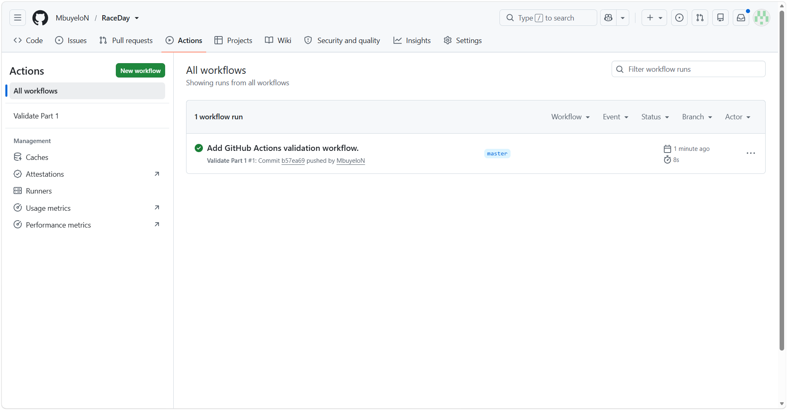

# RaceDay

RaceDay is a web-based event management system designed for South African road running, walking, and cycling events.

The system is designed to support two main user roles:

- **Organiser** – can create and manage events and categories, view event enrolments, and capture participant results.
- **Participant** – can create an account, browse events, enter an event by selecting a category, view their enrolments, and track their personal results.

## Part 1 - System Planning and Database

Part 1 focuses on planning the RaceDay system before application development begins.

The planning documents include:

- Entity Relationship Diagram (ERD)
- API Endpoint Plan
- SQL Server database script
- GitHub Actions validation workflow

These files are stored in the `/docs` folder.

## CI/CD Validation

The GitHub Actions workflow validates that the required Part 1 files are present in the repository.

## Video Presentation

YouTube video link: To be added after recording.